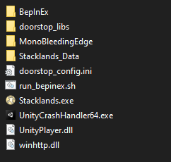

# Card Zones
## About
Adds the ability to create card zones to help organizing your board without increasing the size of the deck.

Drag and drop any card onto the "Make Zone" box at the top to create a new zone for this type.

## Installation
This mod requires BepInEx to work, it is a modding framework that allows multiple mods being loaded.
Furthermore, this mod uses Harmony to patch into the game, which means no game code is distributed and allows multiple mods to change it interdependent.

1. Download BepInEx from https://github.com/BepInEx/BepInEx/releases 
2. Extract all files to your Stacklands folder. It should look like this:\

3. Download this mod and extract it into `BepInEx/plugins/`
4. Launch the game!

## Development
1. Install BepInEx
2. Set your `GAME_PATH` in `CardZones.csproj`
3. This mod requires publicized game code, this removes the need to get private members via heavy Reflection code. Use https://github.com/CabbageCrow/AssemblyPublicizer for example to publicize `Stacklands/Stacklands_Data/Managed/Assembly-CSharp.dll`
4. Compile the project. This copies the resulting dll into `<GAME_PATH>/BepInEx/plugins/`

## Links
- Github: [https://github.com/MSchmoecker/CardZones](https://github.com/MSchmoecker/CardZones)
- Nexus: [https://www.nexusmods.com/stacklands/mods/5](https://www.nexusmods.com/stacklands/mods/5)

## Changelog
0.1.0
- Initial release
